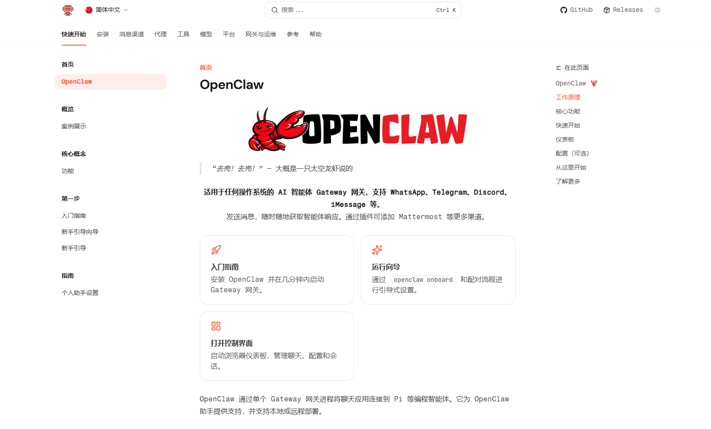
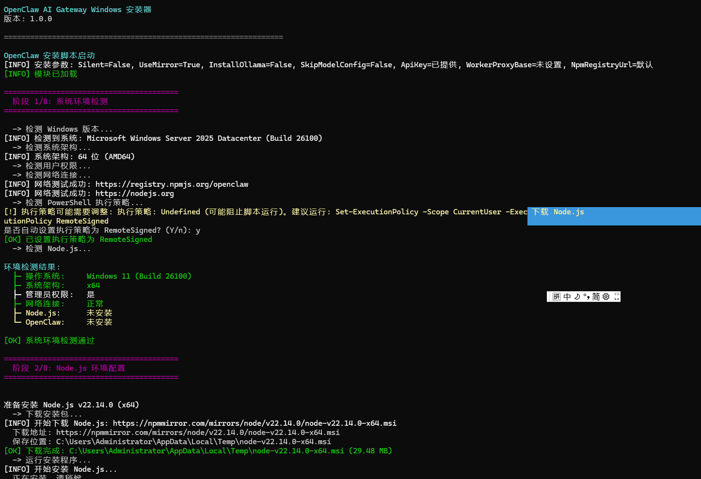
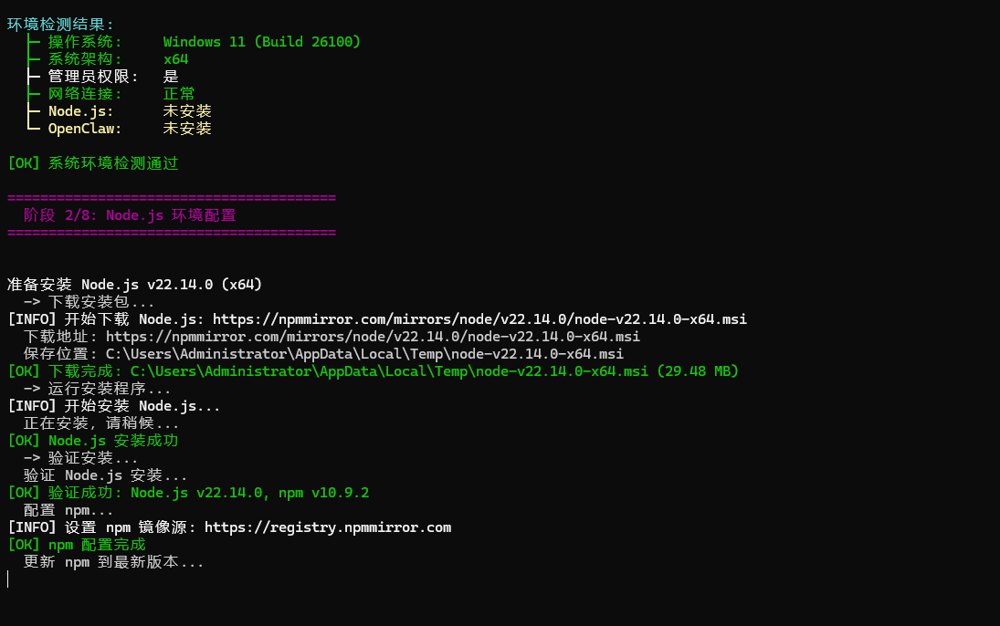
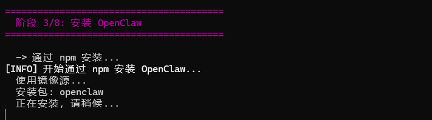
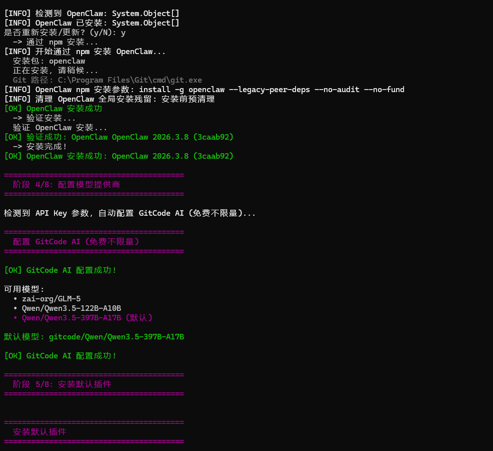
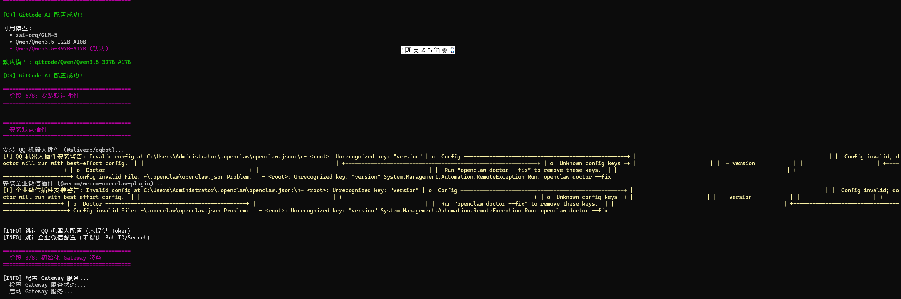
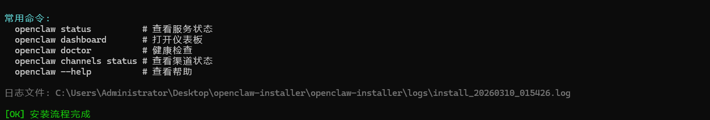
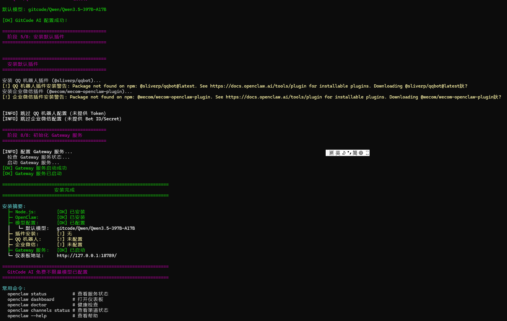

# OpenClaw Installer

  

一个面向 OpenClaw 使用场景的安装与部署方案展示页。

这个仓库的定位不是开源脚本仓库，而是用于介绍能力、展示效果和对接需求。核心安装脚本、配置模板、代理方案和完整交付内容不会在这里公开。

## 这套方案解决什么问题

很多人在实际部署 OpenClaw 时，卡点并不在“会不会敲命令”，而在于整个链路的落地细节：

- 跨平台环境准备麻烦，Windows、Linux、macOS 的处理方式不同
- Node.js、依赖源、网络访问和运行环境容易踩坑
- 模型接入、渠道配置、机器人接入步骤零散
- QQ、企业微信等接入方案对新手不友好
- 部署完成后，日志、排错、维护没有统一入口

这套方案的目标，就是把这些环节整理成一条更省时间、可交付、可复用的流程。

## 能力概览

- 支持 Windows / Linux / macOS 的安装与部署流程
- 支持环境检测、依赖准备、基础运行环境初始化
- 支持主流模型供应商接入与常见配置场景
- 支持 QQ、企业微信等机器人接入需求
- 支持镜像加速、代理转发、网络受限场景优化
- 支持安装日志留存与常见问题排查
- 支持按你的使用场景做定制化交付

## 安装过程展示

下面这些截图展示的是实际安装过程中的一部分界面，方便你先判断这套方案是不是你要的方向。

### 环境检测与初始化

  

### Node.js 环境配置

  

### OpenClaw 安装执行

  

### 更多安装界面补充

以下截图用于补充展示后续步骤、执行输出和结果界面，方便你更直观地了解这套安装流程的完整度。

**补充截图 01**

  

**补充截图 02**

  

**补充截图 03**

  

**补充截图 04**

  

## 适合哪些人

- 想快速跑通 OpenClaw，但不想自己一点点踩坑的人
- 需要在本地或服务器上完成部署的人
- 想接入机器人渠道，但缺少完整配置经验的人
- 希望有人直接给出可落地方案，而不是只看碎片教程的人
- 需要代部署、代配置、问题排查、后续支持的人

## 常见咨询场景

如果你属于下面这些情况，通常不适合继续自己硬试，直接沟通会更省时间：

- 安装过程报错很多，自己排查了一圈还是跑不起来
- 本地能装，服务器环境却始终有兼容性问题
- 想接模型、接渠道、接机器人，但配置项太多
- 网络环境特殊，需要镜像、代理或替代下载方案
- 想尽快交付给团队或客户，不能一直卡在部署阶段
- 希望有人直接给出完整方案，而不是自己拼凑教程

## 说明

- 当前仓库仅用于展示，不提供核心源码
- 不公开完整安装脚本、私有配置和交付细节
- 如果你需要的是“能直接落地”的方案，而不是只看演示页面，可以直接联系我

## 可提供的内容

- 安装包或部署方案说明
- 一对一部署指导
- 常见模型接入与参数配置协助
- QQ / 企业微信接入协助
- 代理、镜像、网络受限环境处理建议
- 定制化部署与后续维护支持

## 对接方式

你可以按下面几种需求来找我：

- 想先了解是否适合你的环境，可以先发你的系统信息和目标场景
- 已经部署到一半卡住了，可以直接发报错截图或日志
- 想要完整可落地方案，可以直接说明你的机器环境、模型需求和接入渠道
- 如果你是给公司或客户做项目，也可以直接谈定制交付和后续支持

## 常见问题

### 这是开源项目吗

不是。这个仓库是展示入口，不公开完整安装脚本和交付实现。

### README 里的内容能不能让我自己完全复刻

不能。这份 README 的作用是帮助你了解方案方向，不是提供完整复刻材料。

### 可以只咨询，不购买完整方案吗

可以，具体看你的问题复杂度和你希望我介入到什么程度。

### 能不能做定制

可以。不同系统环境、模型来源、渠道接入和网络条件，处理方式都不一样，定制是常见需求。

## 联系前建议准备

为了节省双方时间，建议你在联系时尽量带上这些信息：

- 你的系统环境，例如 Windows、Linux 还是 macOS
- 你准备部署在本地电脑、云服务器，还是企业内部机器
- 你想接入的模型来源
- 你是否需要接 QQ、企业微信或其他渠道
- 你现在卡住的步骤、报错截图或日志
- 你希望我提供的是咨询、协助排障，还是完整交付

## 联系方式

需要完整方案、演示、定制部署或技术支持，直接加我微信。

- 微信: `worker_680`
- 邮箱: `admin@zqzqq.com`
- 添加微信请备注: `OpenClaw`
- 如果你方便文字沟通，也可以先发邮件说明你的系统环境、目标需求和当前卡点

  

## 提醒

如果你只是想找一个公开仓库直接下载全部核心内容，这里不提供。

如果你想要的是：

- 能跑起来
- 少踩坑
- 有人协助配置
- 能根据你的环境做调整

那这个仓库就是给你看的入口页。
