

# Tentacle Claw

### 把 OpenClaw 的运行、编排、模型、插件、技能、配置与运维，真正收进一个桌面控制台

  
  
  

  一个更适合 <strong>官网展示</strong>、<strong>项目交付</strong>、<strong>团队演示</strong>、<strong>日常使用</strong> 的 OpenClaw 桌面工作台。 
  首页看全局，模块分层清晰，状态与配置一眼可见，操作入口集中前置。

  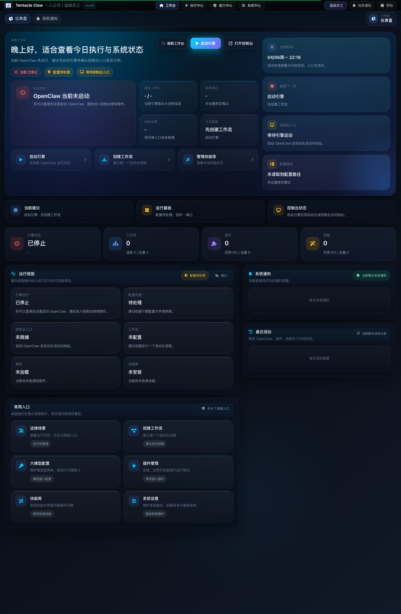

### 一句话理解它

**Tentacle Claw = 一个围绕 OpenClaw 构建的桌面化控制台外壳，用于把状态、流程、资源和配置统一到同一个工作台。**

---

## 快速导航

- [为什么值得做成一个产品首页](#为什么值得做成一个产品首页)
- [核心价值](#核心价值)
- [4 个最重要的卖点](#4-个最重要的卖点)
- [页面展示](#页面展示)
- [适用场景](#适用场景)
- [产品结构](#产品结构)
- [适合谁](#适合谁)
- [FAQ](#faq)
- [截图清单](#截图清单)
- [实测信息](#实测信息)
- [结尾 CTA](#结尾-cta)

---

## 为什么值得做成一个产品首页

很多控制台在真正使用时，问题不在于“功能有没有”，而在于：

- 页面很多，但入口很散
- 能力很多，但状态不集中
- 配置很多，但不适合日常使用
- 可以跑起来，但不好展示、也不好交付

Tentacle Claw 想解决的，就是这类“最后一公里”的体验问题：

> 把 OpenClaw 的运行态、配置态、资源态、流程态统一收敛成一个真正像产品的桌面工作台。

它不是单一页面，也不是简单导航集合，而是一套带有明显产品结构的控制台界面。

---

## 核心价值

<table>
  <tr>
    <td width="33%" valign="top">
      <h3>统一总览</h3>
      
Dashboard 集中承接状态、建议、通知、活动和快捷操作，不再来回切页面找信息。

    </td>
    <td width="33%" valign="top">
      <h3>统一操作</h3>
      
高频动作前置，启动、停止、打开控制台、进入工作流和配置中心都更直接。

    </td>
    <td width="33%" valign="top">
      <h3>统一展示</h3>
      
模块清晰、视觉统一，天然适合官网展示、产品原型、客户演示和交付界面。

    </td>
  </tr>
</table>

---

## 4 个最重要的卖点

### 1. 首页不是装饰，是控制中心

你在 Dashboard 首页就能快速判断：

- 引擎是否运行
- 配置是否可用
- 控制台是否可打开
- 工作流 / 插件 / 技能是否准备就绪
- 当前最值得优先处理的事情是什么

  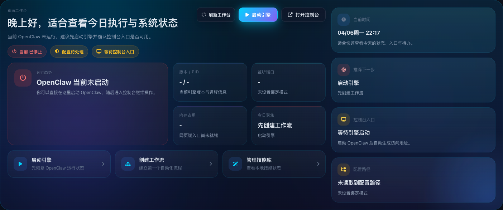

### 2. 高频操作被放到了最前面

这类产品最怕“能做，但很难点到”。

Tentacle Claw 直接把高频动作前置：

- 刷新工作台
- 启动 / 停止引擎
- 打开控制台
- 进入工作流、模型、插件、技能、设置

  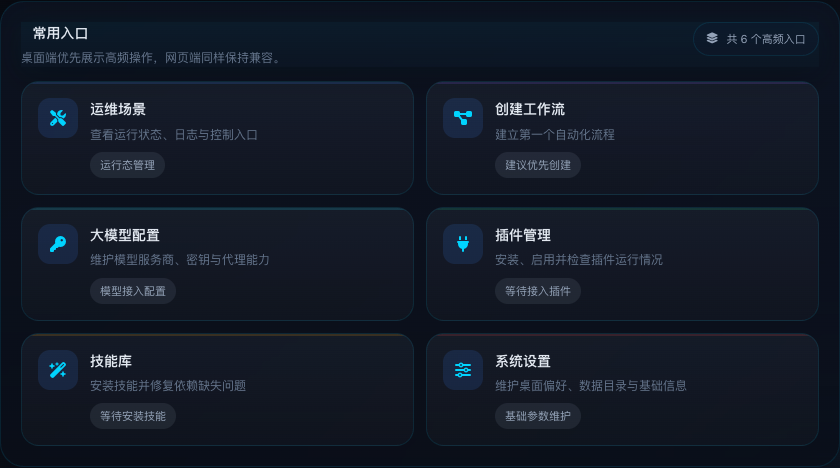

### 3. 运行态、配置态、资源态打通在一屏

很多桌面工作台的问题不是没信息，而是信息彼此割裂。

这里把关键状态集中展示：

- 版本 / PID / 端口 / 内存
- 配置路径与配置校验
- 控制台入口状态
- 工作流、插件、技能准备情况

  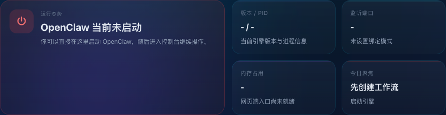
  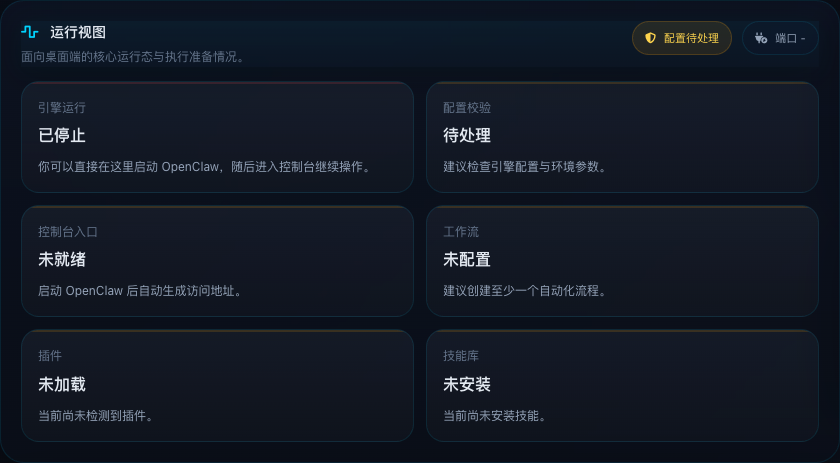

### 4. 这套结构天然适合继续产品化

当前结构非常适合继续往成熟产品迭代：

- 首页做统一总览
- 执行层做日常操作
- 能力层做资源管理
- 系统层做底层维护

这意味着它不仅适合“演示”，也适合“继续做大”。

---

# 页面展示

## Dashboard · 首页总览

  

**你会看到：**
- 全局状态
- 当前建议
- 常用操作
- 通知提醒
- 最近活动

---

## 执行中心 · 智能对话工作台

  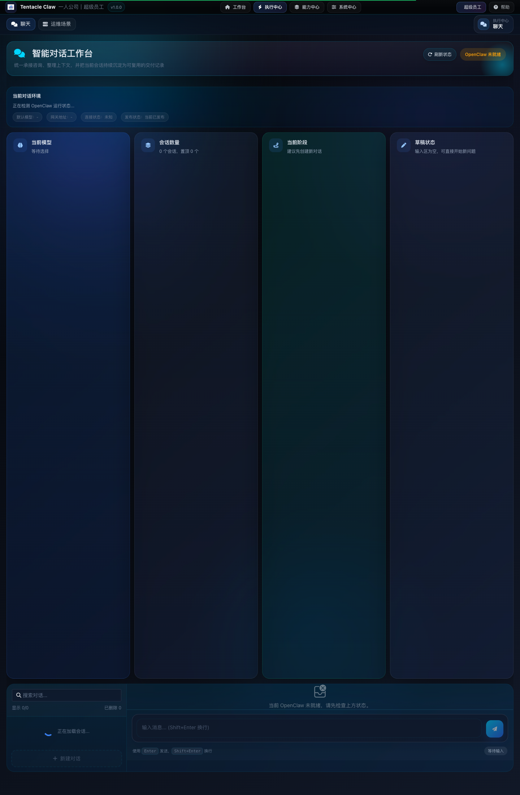

**适合：** 对话承接、会话管理、模型状态查看、输入交互。

---

## 执行中心 · 运维场景

  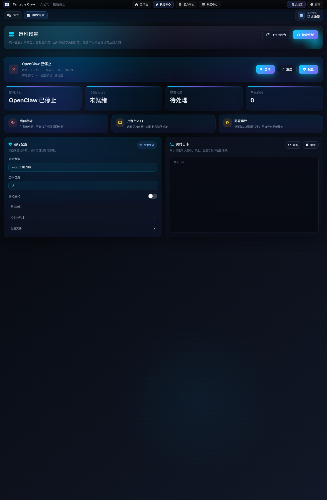

**适合：** 启动 / 重启、查看运行状态、确认控制台入口、查看日志。

---

## 执行中心 · 工作流工作台

  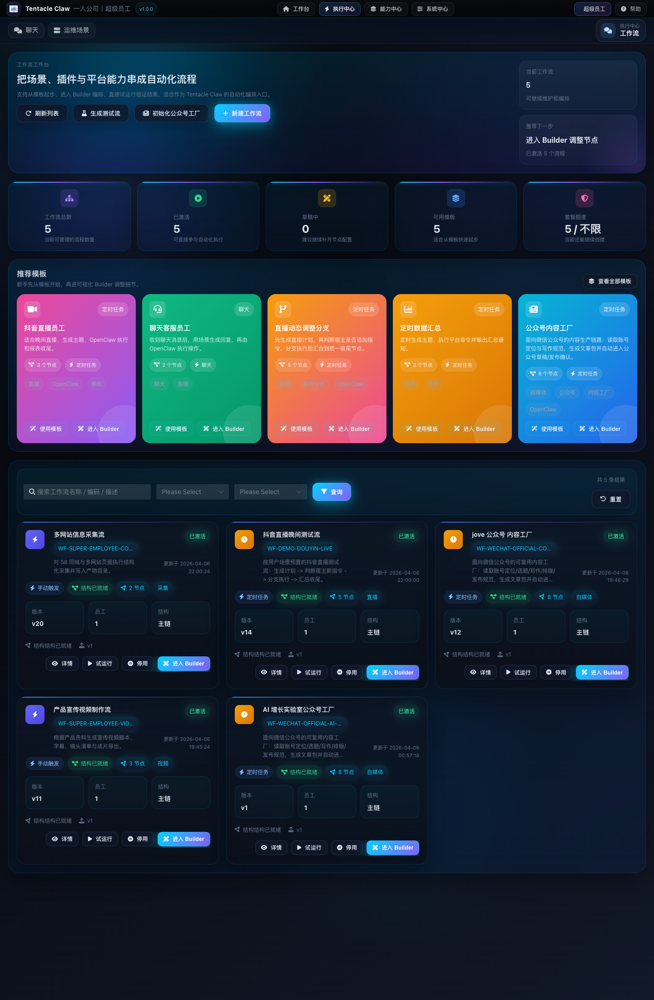

**适合：** 模板起步、Builder 编排、流程管理、激活状态查看。

---

## 能力中心 · 大模型配置中心

  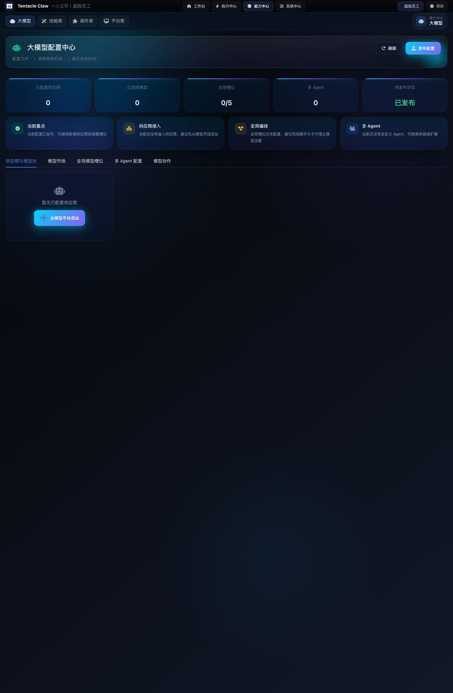

**适合：** 供应商接入、模型池维护、全局模型槽位、多 Agent 配置。

---

## 能力中心 · 插件库 / 技能库

<table>
  <tr>
    <td width="50%" valign="top">
      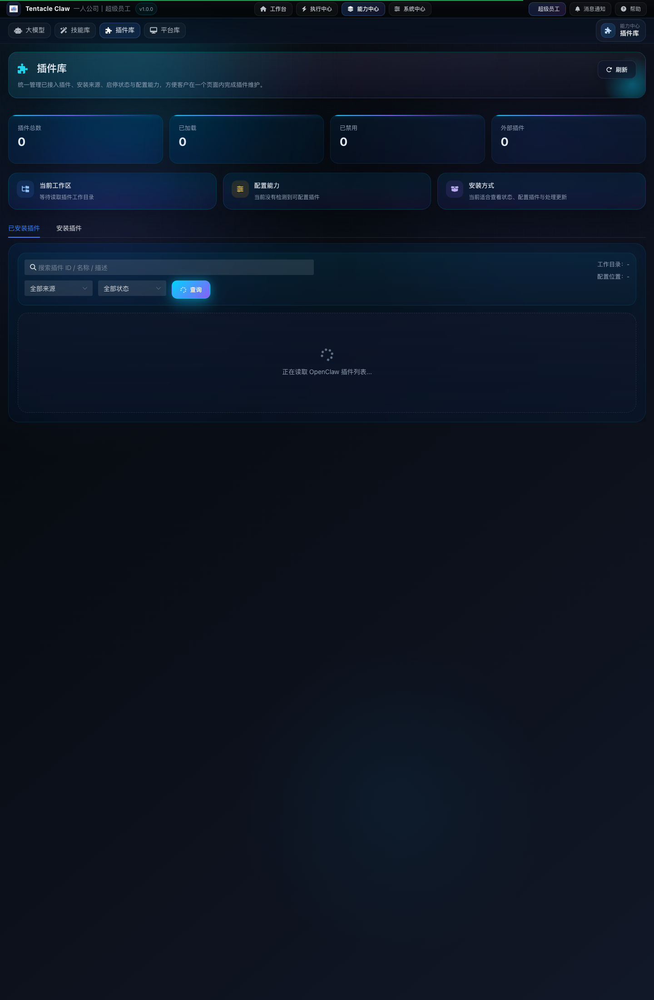
    </td>
    <td width="50%" valign="top">
      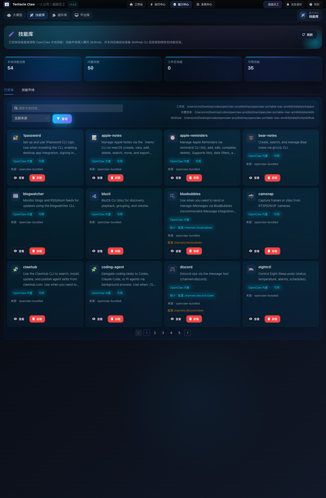
    </td>
  </tr>
</table>

**适合：** 统一管理插件与技能，降低资源维护复杂度。

---

## 系统中心 · 引擎配置 / 设置 / 帮助

<table>
  <tr>
    <td width="34%" valign="top">
      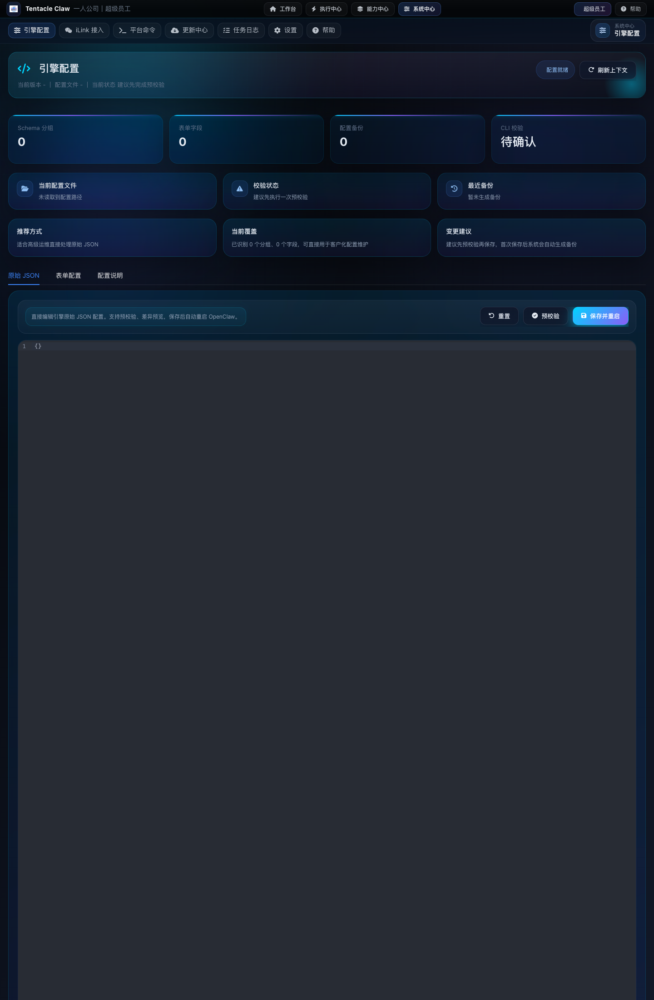
    </td>
    <td width="33%" valign="top">
      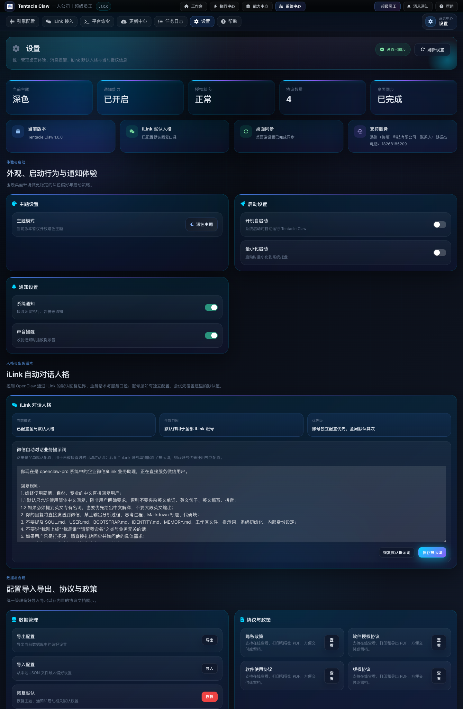
    </td>
    <td width="33%" valign="top">
      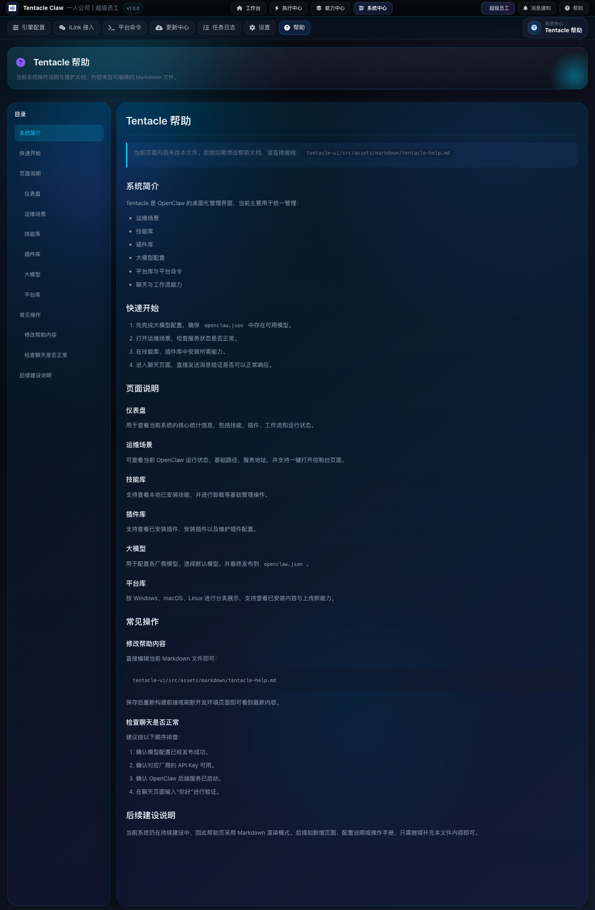
    </td>
  </tr>
</table>

**适合：** 底层配置维护、桌面体验管理、文档沉淀与操作说明。

---

## 适用场景

### 1. 官网展示
当你需要把系统讲清楚、展示清楚，这种结构比零散截图更有说服力。

### 2. 项目交付
当你要把 OpenClaw 能力整合成一个可交付的桌面界面，这种结构天然更合适。

### 3. 团队演示
适合做内部评审、客户汇报、方案演示、原型确认。

### 4. 日常使用
不仅能看，而且适合频繁点、频繁进、频繁切换，是可真正落地的工作台形态。

---

## 产品结构

### 总入口
- Dashboard

### 执行层
- 智能对话工作台
- 运维场景
- 工作流工作台

### 能力层
- 大模型配置中心
- 插件库
- 技能库

### 系统层
- 引擎配置
- 设置
- 帮助中心

**这套结构最大的优势：** 好看、好讲、好用、好扩展。

---

## 适合谁

- 想把 OpenClaw 做成统一工作台的人
- 需要一个更适合官网展示和演示的控制台界面的人
- 想把零散能力整合成完整产品外壳的人
- 想同时兼顾运行、配置、资源管理的人
- 想继续把这个方向做成产品的人

---

## FAQ

### 这是静态页面吗？
不是。根据本次访问结果，页面内容会随着本地环境状态变化而变化。

### 它更偏运维，还是更偏业务？
两者都有：运维场景和引擎配置偏运维；工作流、模型配置、对话工作台偏业务执行。

### 它适合继续扩展吗？
适合。当前模块边界已经很清晰，继续扩展权限、账号、更多资源管理能力会比较顺。

### 为什么它适合做官网首页展示？
因为它具备完整产品结构、清晰模块边界和统一视觉语言，天然比单点截图更适合表达价值。

---

## 截图清单

截图位于 `images/dashboard/`：

- `dashboard.png`
- `dashboard-home.png`
- `dashboard-status.png`
- `dashboard-runview.png`
- `dashboard-entries.png`
- `dashboard-notices.png`
- `dashboard-activity.png`
- `chat.png`
- `ops.png`
- `workflow.png`
- `llm.png`
- `plugins.png`
- `skills.png`
- `openclaw-config.png`
- `settings.png`
- `tentacle-help.png`
- `routes-summary.json`

---

## 实测信息

- 页面地址：`http://localhost:5173/dashboard`
- 实测日期：**2026-04-06**
- 页面内容基于本地运行环境动态生成

---

## 结尾 CTA

## 如果你想要的不是零散页面，而是一套真正像产品的桌面控制台

### 那么 Tentacle Claw 已经非常接近那个答案了。

**它不是只会展示，而是已经具备“可展示、可使用、可交付、可扩展”的产品雏形。**

